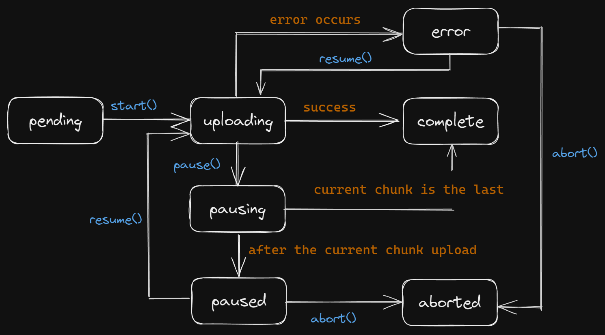

# API Reference

## ChunkUploader

```ts
class ChunkUploader<TMetadata extends Metadata> {
  constructor(options: ChunkUploaderOptions<TMetadata>);
  get status(): ChunkUploaderStatus;
  get bytesUploaded(): number;
  get error(): unknown;
  get file(): File;
  start(): boolean;
  get canStart(): boolean;
  pause(): boolean;
  get canPause(): boolean;
  resume(): boolean;
  get canResume(): boolean;
  abort(): boolean;
  get canAbort(): boolean;
}
```

### Constructor

```ts
new ChunkUploader(options: ChunkUploaderOptions)
```

- __Parameters__
  - options: [ChunkUploaderOptions](#chunkuploaderoptions)

### Properties or Methods

#### __status__ - `Accessor`

```ts
status: 'pending' | 'uploading' | 'pausing' | 'paused' | 'aborted' | 'complete' | 'error'
```

The status of the uploader

Reference: [How status changes](#how-status-changes)

#### __bytesUploaded__ - `Accessor`

```ts
bytesUploaded: number
```

Bytes uploaded so far.

#### __error__ - `Accessor`

```ts
error: unknown
```

The error that occurred during the upload process. This is `undefined` if no error occurred.

#### __file__ - `Accessor`

```ts
file: File
```

The file for the upload process.

#### __start__ - `Method`

```ts
start(): boolean
```

Start the upload process. returns `false` if the status is not `pending`.

- status: `pending` -> `uploading` -> `complete` or `error`

#### __canStart__ - `Accessor`

```ts
canStart: boolean
```

`true` if the status is `pending`.


#### __pause__ - `Method`

```ts
pause(): boolean
```

Pause the upload process. returns `false` if the status is not `uploading`.

Note that the status at the end could be `complete` if the last chunk is being uploaded when the function is called.

- status: `uploading` -> `pausing` -> `paused` or `complete`

#### __canPause__ - `Accessor`

```ts
canPause: boolean
```

`true` if the status is `uploading`.

#### __resume__ - `Method`

```ts
resume(): boolean
```

Resume the upload process. returns `false` if the status is not `paused` or `error`.

- status: `paused` or `error` -> `uploading` -> `complete` or `error`

#### __canResume__ - `Accessor`

```ts
canResume: boolean
```

`true` if the status is `paused` or `error`.

#### __abort__ - `Method`

```ts
abort(): boolean
```

Abort the upload process. returns `false` if the status is not `paused` or `error`.

- status: `paused` or `error` -> `aborted`

#### __canAbort__ - `Accessor`

```ts
canAbort: boolean
```

`true` if the status is `paused` or `error`.

## ChunkUploaderOptions

```ts
interface ChunkUploaderOptions<TMetadata extends Metadata> {
  file: File;
  onChunkUpload: ChunkUploadHandler<TMetadata>;
  metadata: TMetadata;
  chunkBytes?: number;
  retryDelays?: number[];
  onChunkComplete?: (bytesAccepted: number, bytesTotal: number) => void;
  onSuccess?: () => void;
  onError?: (error: unknown) => void;
  onPaused?: () => void;
  onAborted?: (metadata: TMetadata) => void;
  onStatusChange?: (
    oldStatus: ChunkUploaderStatus | undefined,
    newStatus: ChunkUploaderStatus
  ) => void;
}
```

### Properties

#### __file__ - `Required`

```ts
file: File
```

The file to be uploaded

#### __onChunkUpload__ - `Required`

```ts
onChunkUpload: (chunkFormData, metadata) => Promise<void>
```

The function that defines how the chunk is uploaded to the server.

- __Parameters__
  - chunkFormData: [ChunkFormData](#chunkformdata)
  - metadata: [Metadata](#metadata---required)

#### __metadata__ - `Required`

```ts
metadata: (TMetadata extends Record<string, string | boolean | number | undefined | null>)
```

The metadata to send with each chunk. This can be used to send additional information like the file name, file type, etc.

#### __chunkBytes__ - `Optional`

Default: `5MB` (5 * 1024 * 1024)

```ts
chunkBytes?: number
```

The number of bytes to send in each chunk.

#### __retryDelays__ - `Optional`

Default: `[1000, 2000, 4000, 8000]`

```ts
retryDelays?: number[]
```

Milliseconds to wait before retrying a failed chunk upload. Set to an empty array to disable retries.

#### __onChunkComplete__ - `Optional`

Default: `undefined`

```ts
onChunkComplete?: (bytesAccepted: number, bytesTotal: number) => void
```

A callback that is called when a chunk is uploaded.

#### __onSuccess__ - `Optional`

Default: `undefined`

```ts
onSuccess?: () => void
```

A callback that is called when the file is sucessfully uploaded.

#### __onError__ - `Optional`

Default: `undefined`

```ts
onError?: (error: unknown) => void
```

A callback that is called when an error occurs during the upload process.

#### __onPaused__ - `Optional`

Default: `undefined`

```ts
onPaused?: () => void
```

A callback that is called when the upload process is paused.

#### __onAborted__ - `Optional`

Default: `undefined`

```ts
onAborted?: (metadata) => void
```

A callback that is called when the upload process is aborted.

- __Parameters__
  - metadata: [Metadata](#metadata---required)

#### __onStatusChange__ - `Optional`

Default: `undefined`

```ts
onStatusChange?: (oldStatus, newStatus) => void
```

A callback that is called when the status of the uploader changes.

- __Parameters__
  - oldStatus: [ChunkUploaderStatus](#status---accessor) | `undefined`
  - newStatus: [ChunkUploaderStatus](#status---accessor)

## ChunkFormData

```ts
interface ChunkFormData {
  get(name: 'blob'): Blob;
  get(name: 'offset'): `${number}`;
  get(name: 'length'): `${number}`;
  get(name: 'retry'): `${number}`;
  get(name: 'total'): `${number}`;
  get(name: 'isLastChunk'): 'true' | 'false';
}
```

The form data that is sent with each chunk. This includes the chunk blob, the offset, the length, and other information.

# Others

## How [status](#status---accessor) changes

